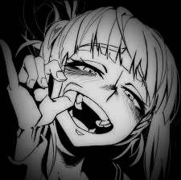

# NyxVaultX — Web Page 🌐

## Description
NyxVaultX is a modern, interactive personal website for a programmer and cybersecurity enthusiast. The project combines eye-catching design, dynamic animations, and multimedia features.

## ✨ Main Features & Effects

- 🖼️ **4K Wallpaper** — Fullscreen, high-resolution background image.
- ✨ **Sparkle Rain Effect** — Animated, falling sparkles across the entire page.
- 🪪 **Profile Card** — Centered, semi-transparent card with blur and animated border.
- 🌈 **Neon Gradients** — Animated neon text and border effects.
- 🔗 **Social Media Buttons** — Links to GitHub and Instagram with glowing hover effects.
- 🎵 **Background Music** — Automatic, hidden audio playback (starts after user interaction).
- 🎚️ **Custom Audio Player** — (Optional) Stylish player with background, title, progress bar, and play/pause button.

## 🛠️ Technologies
- HTML5
- CSS3 (animations, gradients, blur, media queries)
- JavaScript (effects, audio handling)
- Boxicons (social icons)

## 🚀 How to Run
1. Open `index.html` in your browser.
2. Make sure all images and audio files are in the correct folders (`theme/wallpaper/`, `theme/Sound/`).
3. After loading the page, click or press any key to start background music (browser requirement).

## 👤 Author
NyxVaultX
